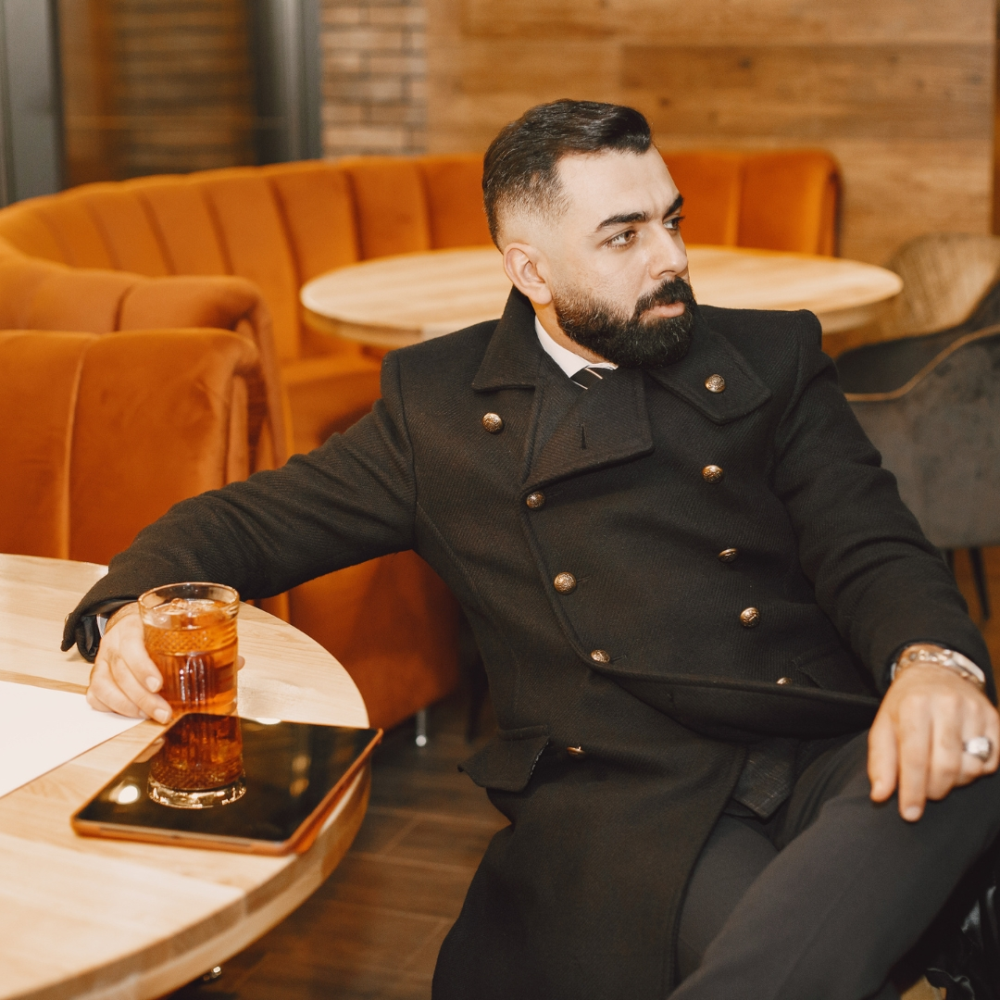
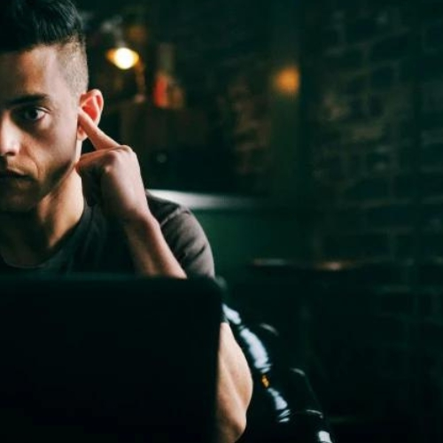

# Motivational-Posts-Generator-For-Instagram

 This project's goal is to automate the process of overlaying text onto images. Images to be overlayed with text are to be stored in the ```/in/bkg``` directory. The lines of text are to be stored in a text file ```quotes.txt```.

## Motivation

A common design for a post on social media is an image overlayed with text. These types of posts show up a lot in niches aimed at self-motivation, specifically those concerned with physical fitness. 

If, say, an Instagram page aims at posting more than one image a day, then the task of creating these images can take up significant time. Formatting the image is especially tedious; one must make sure the text has the right font, font size and font colour as well as being correctly aligned on the image.

However, beyond the formatting, the recipe for these images is simple, it includes:

1. an image
2. a quote
3. a trademark (optional)
 
So one may see that it can be very beneficial yet straightforward to automate the process.

Below is a screenshot from my Instagram accounts geared at promoting personal motivations for programmers. Notice the identical formatting of the images, very automatable!


## Getting Started

Clone:
```git clone https://github.com/pythontester192/Motivational-Posts-Generator-For-Instagram.git```

Run the script:
```python post_generator.py```

### Prerequisites

Python

## Built With

* Python Imaging Library (PIL)
* Python textwrap module

## Examples

Consider the following raw images located in the ```in/bkg``` directory: 

   

and consider the following text file located in the ```/in``` directory:

*quotes.txt*

~~~
First caption.
Second caption.
Third caption.
~~~

#### Example 1 - overlaying images in order:
Suppose we want to overlay the first quote in the text file with the first raw image, the second quote with the second raw image and the third quote with the raw third image.

To do this, we ould run the script and specify that we do not wish to generate all combinations of the raw images and lines of text. 

~~~
python post_generator.py
Generate all combinations? (y/n): n
Include trademark/logo? (y/n): y
Overlaying bkg0.jpg...
Output image saved as: out/_First capt.png
Overlaying bkg1.jpg...
Output image saved as: out/_Second cap.png
Overlaying bkg2.jpg...
Output image saved as: out/_Third capt.png
~~~

The following images are then stored in the ```/out``` directory:

    
 
**note**: We chose to include the trademarks in these images.   An image file, ```logopy.png```, in the ```/utils``` directory specifies the logo, and the trademark text (the text below the logo) is specified in the ```post_generator.py``` script.

#### Example 2 - generating all combinations of overlays:

Consider the same text file and the same three images as above. Perhaps we just want to create all possible combinations of raw image and quote and then decide which ones go well together later. 

Here, we will overlay each quote with each raw image in order to create all combinations of pairings. 

~~~
python post_generator.py
Generate all combinations? (y/n): y
Include trademark/logo? (y/n): y
Overlaying bkg0.jpg...
Output image saved as: out/0_First capt.png
Overlaying bkg0.jpg...
Output image saved as: out/0_Second cap.png
Overlaying bkg0.jpg...
Output image saved as: out/0_Third capt.png
Overlaying bkg1.jpg...
Output image saved as: out/1_First capt.png
Overlaying bkg1.jpg...
Output image saved as: out/1_Second cap.png
Overlaying bkg1.jpg...
Output image saved as: out/1_Third capt.png
Overlaying bkg2.jpg...
Output image saved as: out/2_First capt.png
Overlaying bkg2.jpg...
Output image saved as: out/2_Second cap.png
Overlaying bkg2.jpg...
Output image saved as: out/2_Third capt.png
~~~

The following images are then stored in the ```/out``` directory:
 
  

  
 
  
